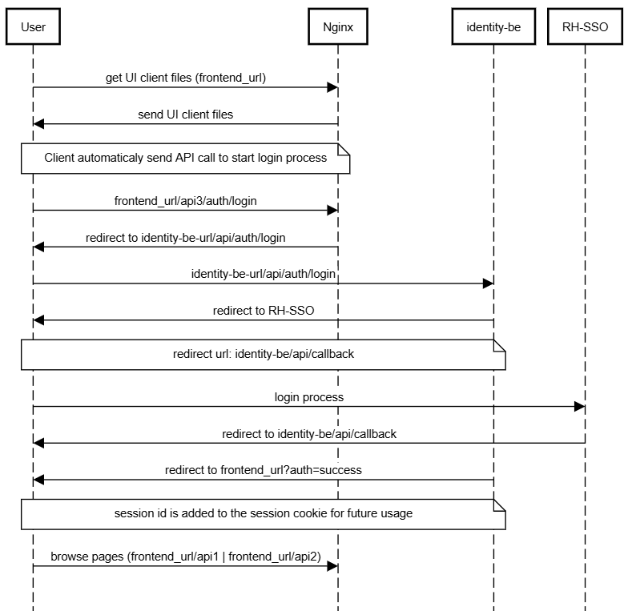

Below is the flowchart of the authentication flow.

A few notes:
1. 2 routes are being used, one for the main app and one for the identity pod
2. currently we only used directly a flask server with the auth manager.





the flow chart was created using the site [sequencediagram](https://sequencediagram.org/)
the chart text is below:


```
title Unifai Authentication process

User->Nginx: get UI client files (frontend_url)
Nginx->User: send UI client files
note over User,Nginx:Client automaticaly send API call to start login process
User->Nginx: frontend_url/api3/auth/login
Nginx->User: redirect to identity-be-url/api/auth/login
User->identity-be: identity-be-url/api/auth/login
identity-be->User: redirect to RH-SSO
note over User,identity-be:redirect url: identity-be/api/callback
User->RH-SSO: login process
RH-SSO->User: redirect to identity-be/api/callback
identity-be->User: redirect to frontend_url?auth=success
User->Nginx: browse pages (frontend_url/api1 | frontend_url/api2)
```

## Logout and login (GENIE-827)

- **`POST /api/auth/logout`** — Clears the server-side session and cookie, and **best-effort** calls Keycloak’s **OpenID Connect logout** with the stored **refresh token** so the SSO session can be ended server-side, not only in the browser.
- **Login page** — The UI serves **`/login`** with a single **SSO** action; that route is outside the authenticated shell so users can open it while logged out.


logout action (manual):

curl ${KEYCLOACK_BASE_URL}/realms/${KEYCLOACK_REALM}/protocol/openid-connect/logout \
-d client_id=$CLIENT_ID \
-d client_secret=$CLIENT_SECRET \
-d refresh_token=$REFRESH_TOKEN